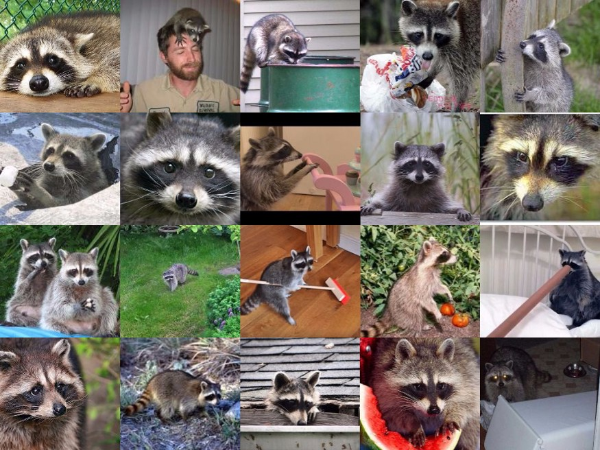
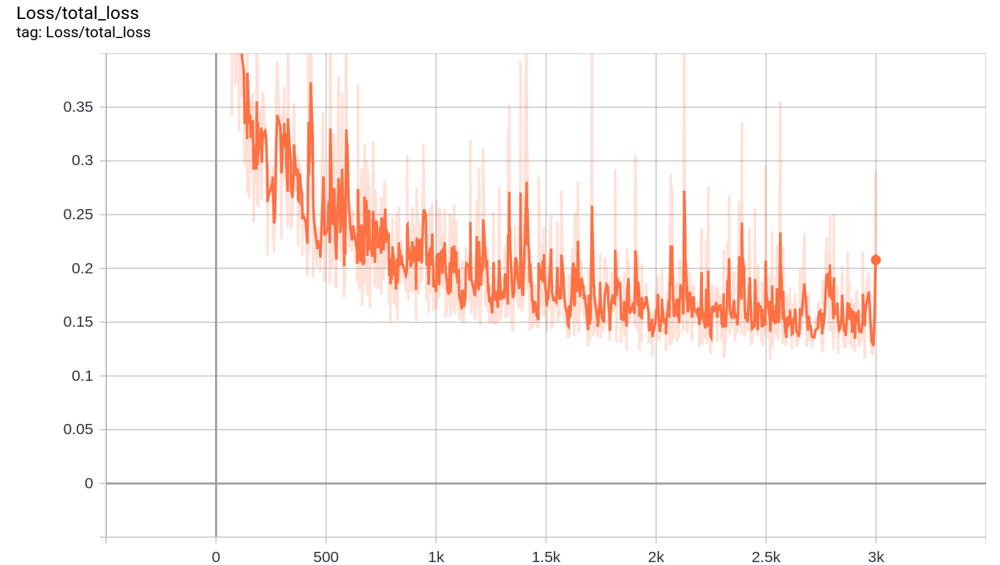
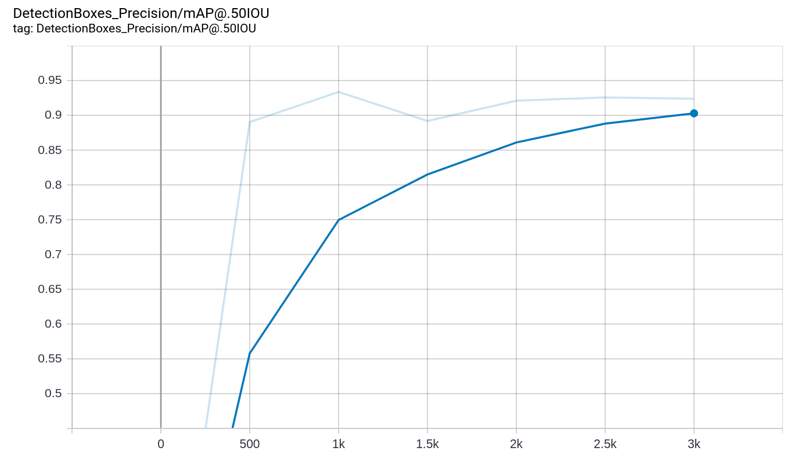

# Tensorflow 2 Object Detection API Tutorial 

[](https://www.python.org/downloads/release/python-360/)
[](https://github.com/tensorflow/tensorflow/releases/tag/v2.2.0)

## Introduction


With the [announcement](https://blog.tensorflow.org/2020/07/tensorflow-2-meets-object-detection-api.html) that [Object Detection API](https://github.com/tensorflow/models/tree/master/research/object_detection) is now compatible with Tensorflow 2,
I tried to test the new models published in the [TF2 model zoo](https://github.com/tensorflow/models/blob/master/research/object_detection/g3doc/tf2_detection_zoo.md), and train them with my custom data.
However, I have faced some problems as the scripts I have for Tensorflow 1 is not working with Tensorflow 2 (which is not surprising!), in addition to having very poor documentation and tutorials from tensorflow models repo.
In this repo I am sharing my experience, in addition to providing clean codes to run the inference and training object detection models using Tensorflow 2.
 
This tutorial should be useful for those who have experience with the API but cannot find clear examples for the new changes to use it with Tensorflow 2.
However, I will add all the details and working examples for the new comers who are trying to use the object detection api for the first time, so hopefully this tutorial will make it easy for beginners to get started and run their object detection models easily.


## Roadmap

This tutorial will take you from installation, to running pre-trained detection model, then training your model with a custom dataset, and exporting your model for inference.

1. [Installation](#installation)
2. [Inference with pre-trained models](#inference-with-pre-trained-models)
3. [Preparing your custom dataset for training](#preparing-your-custom-dataset-for-training)
4. [Training object detection model with your custom dataset](#training-object-detection-model-with-your-custom-dataset)
5. [Exporting your trained model for inference](#exporting-your-trained-model-for-inference)


## Installation

The examples in this repo is tested with python 3.6 and Tensorflow 2.2.0, but it is expected to work with other Tensorflow 2.x versions with python version 3.5 or higher.

It is recommended to install [anaconda](https://www.anaconda.com/products/individual) and create new [environment](https://docs.conda.io/projects/conda/en/latest/user-guide/tasks/manage-environments.html) for your projects that use the installed packages:

```bash
# create new environment
conda create --name py36-tf2 python=3.6

# activate your environment before installation or running your scripts 
conda activate py36-tf2
``` 

You need first to install tensorflow 2, either with GPU or CPU only support (slow). For Installation with GPU support, you need to have CUDA 10.1 with CUDNN 7.6 to use Tensorflow 2.2.0.
You can check the compatible versions of any tensorflow version with cuda and cudnn versions from [here](https://www.tensorflow.org/install/source#tested_build_configurations).
If you have the matching CUDA and CUDNN versions in your system, install tensorflow-gpu as follows: 

```bash
# if you have NVIDIA GPU with cuda 10.1 and cudnn 7.6
pip install tensorflow-gpu==2.2.0
```

Otherwise, a great feature of Anaconda is that it can automatically install a local version of cudatoolkit that is compatible with your tensorflow version (But you should have the proper nvidia gpu drivers installed).
But be aware that this cuda version will be only available to your python environment (or virtual environment if you created one), and will not be available for other python versions or other environments.

```bash
# installation from anaconda along with cudatoolkit (tf2 version 2.2.0)
conda install -c anaconda tensorflow-gpu==2.2.0

# or to install latest version of tensorflow, just type
conda install -c anaconda tensorflow-gpu
```

for CPU only support:

```bash
# CPU only support (slow)
pip install tensorflow==2.2.0
```

After that, you should install the Object Detection API, which became much easier now after the latest update.
The official installation instructions can be found [here](https://github.com/tensorflow/models/blob/master/research/object_detection/g3doc/tf2.md), but I will add here the instruction to install it as a python package.

Clone the TensorFlow models repository:

```bash
git clone https://github.com/tensorflow/models.git
```

Make sure you have [protobuf compiler](https://grpc.io/docs/protoc-installation/#install-using-a-package-manager) version >= 3.0, by typing `protoc --version`, or install it on Ubuntu by typing `apt install protobuf-compiler`.

Then proceed to the python package installation as follows:

```bash
# remember to activate your python environment first
cd models/research
# compile protos:
protoc object_detection/protos/*.proto --python_out=.
# Install TensorFlow Object Detection API as a python package:
cp object_detection/packages/tf2/setup.py .
python -m pip install .
```

The previous commands installs the object detection api as a python package that will be available in your python environment (or virtual environment if you created one),
and will automatically install all required dependencies if not already installed.

Finally, to test that your installation is correct, type the following command: 

```bash
# Test the installation.
python object_detection/builders/model_builder_tf2_test.py
```

For more installation options, please refer to the original [installation guide](https://github.com/tensorflow/models/blob/master/research/object_detection/g3doc/tf2.md).

To run the examples in this repo, you will need some additional dependencies:

```bash
# install OpenCV python package
pip install opencv-python
pip install opencv-contrib-python
```
------------------------------------------------------------

## Inference with pre-trained models

To go through the tutorial, clone this tutorial repo and follow the instructions step by step. 

```bash
git clone https://github.com/abdelrahman-gaber/tf2-object-detection-api-tutorial.git
```

To get started with the Object Detection API with TF2, let's download one of the models pre-trained with coco dataset from the [tf2 detection model zoo](https://github.com/tensorflow/models/blob/master/research/object_detection/g3doc/tf2_detection_zoo.md), and use it for inference.

You can download any of the models from the table in the [model zoo](https://github.com/tensorflow/models/blob/master/research/object_detection/g3doc/tf2_detection_zoo.md), and place it in the [models/](models) directory. For example, let's download the EfficientDet D0 model.
 
```bash
# cd tf2-object-detection-api-tutorial
cd models/
# download the model
wget http://download.tensorflow.org/models/object_detection/tf2/20200711/efficientdet_d0_coco17_tpu-32.tar.gz
# extract the downloaded file
tar -xzvf efficientdet_d0_coco17_tpu-32.tar.gz
```

In the tensorflow object detection repo, they provide a tutorial for inference in this [notebook](https://github.com/tensorflow/models/blob/master/research/object_detection/colab_tutorials/inference_from_saved_model_tf2_colab.ipynb), but it is not so clean and needs many improvements.
Therefore, I have created a class for object detection inference [detector.py](detector.py), along with an example script [detect_objects.py](detect_objects.py) to use this class to run the inference with input images, or from a video.   

I encourage you to have a look at the [class file](detector.py) and the [example script](detect_objects.py) and adapt it to your application. But let's first see how to use it to get the inference running with the EfficientDet D0 model we have just downloaded.  

We can provide some argument when running the [detect_objects.py](detect_objects.py) script. For instance, the `--model_path` argument sets the path of the trained model, and the `--path_to_labelmap` points to the labelmap file of your dataset (here we use the one for coco dataset).
To run the detection with set of images, provide a path to the folder containing the images in the argument `--images_dir`.

```bash
python detect_objects.py --model_path models/efficientdet_d0_coco17_tpu-32/saved_model --path_to_labelmap models/mscoco_label_map.pbtxt --images_dir data/samples/images/
```

Sample output from the detection with the pretrained EfficientDet D0 model:


You can also select a set of classes to be detected by passing their labels to the argument `--class_ids` as a string with the "," delimiter. For example, using `--class_ids "1,3" ` will do detection for the classes "person" and "car" only as they have id 1 and 3 respectively
(you can check the id and labels from the [coco labelmap](models/mscoco_label_map.pbtxt)). Not using this argument will lead to detecting all objects in the provided labelmap.

Let's use video input by enabling the flag `--video_input`, in addition to detecting only people by passing id 1 to the `--class_ids` argument. The video used for testing is downloaded from [here](https://www.youtube.com/watch?v=pk96gqasGBQ).

```bash
python detect_objects.py --video_input --class_ids "1" --threshold 0.3  --video_path data/samples/pedestrian_test.mp4 --model_path models/efficientdet_d0_coco17_tpu-32/saved_model --path_to_labelmap models/mscoco_label_map.pbtxt
```

------------------------------------------------------------

## Preparing your custom dataset for training

In this tutorial, let's use the interesting [raccoon dataset](https://github.com/datitran/raccoon_dataset) collected by [Dat Tran](https://dat-tran.com/). 
The raccoon dataset contains a total of 200 images with 217 raccoons, which is suitable to use in tutorial examples.

The original [dataset repo](https://github.com/datitran/raccoon_dataset) provides many scripts to deal with the dataset and randomly select images for train and test splits with 160 and 40 images respectively.
However, just for convenience, and to decrease the efforts needed from you, I have included the dataset images and annotation in this repo (in [data/raccoon_data/](data/raccoon_data) ),
and split them manually, taking the first 160 images for training, and the last 40 images for testing.
I recommend checking the original [dataset repo](https://github.com/datitran/raccoon_dataset), along with this [article](https://towardsdatascience.com/how-to-train-your-own-object-detector-with-tensorflows-object-detector-api-bec72ecfe1d9) written by the author of the dataset. 
Here are some images from the raccoon dataset ([source](https://towardsdatascience.com/how-to-train-your-own-object-detector-with-tensorflows-object-detector-api-bec72ecfe1d9)).




First step to start training your model is to generate [TFRecord](https://www.tensorflow.org/tutorials/load_data/tfrecord) files from the dataset annotations.
TFRecord is a binary file format that makes dealing with large datasets more efficient, you can read more about TFRecords in this [article](https://medium.com/mostly-ai/tensorflow-records-what-they-are-and-how-to-use-them-c46bc4bbb564).
The Tensorflow Object Detection API provides examples to generate tfrecords from annotations that have the same shape as pascal voc or oxford pet dataset (you can see the instructions [here](https://github.com/tensorflow/models/blob/master/research/object_detection/g3doc/preparing_inputs.md)).
But generally, you may have your data annotations in any format, so let's generate intermediate format as csv file, then use it to generate our tfrecords.

First we need to convert the xml annotations files to csv, which was [provided in the raccoon dataset repo](https://github.com/datitran/raccoon_dataset/blob/master/xml_to_csv.py).
I just took this file and refined it a little, and used argparse package to input our pathes as arguments, you can find the refined file in [data_gen/xml_to_csv.py](data_gen/xml_to_csv.py). 
You can use this file as follow:

```bash
cd data_gen
python xml_to_csv.py --annot_dir ../data/raccoon_data/train/annotations --out_csv_path ../data/raccoon_data/train_labels.csv
```

After generating the csv file, use it to genrate the tfrecord files.
In the tensorflow detection repo they provide a good [tutorial](https://github.com/tensorflow/models/blob/master/research/object_detection/g3doc/using_your_own_dataset.md) to deal with your custon data and generate tfrecords.
I have used the examples provided, and solved some issues to make it work with TF2, in addition to using argparse to make it easier to use for any data in the future.
You can find my file in [data_gen/generate_tfrecord.py](data_gen/generate_tfrecord.py), and you can use it as follows:

```bash
python generate_tfrecord.py --path_to_images ../data/raccoon_data/train/images \ 
                            --path_to_annot ../data/raccoon_data/train_labels.csv \
                            --path_to_label_map ../models/raccoon_labelmap.pbtxt \
                            --path_to_save_tfrecords ../data/raccoon_data/train.record
``` 

For convenience, I have added all these steps in one shell script that you can run to generate the csv files and use them to generate the tfrecords.
So instead of the previous steps, just run this shell file as follows:

```bash
cd data_gen/
bash gen_data.sh 
```  

After running this command, you will find the generated csv and tfrecords files located in [data/raccoon_data](data/raccoon_data). 
Et voila, we have the tfrecord files generated, and we can use it in next steps for training.

------------------------------------------------------------

## Training object detection model with your custom dataset

To start training our model, we need to prepare a configuration file specifying the backbone model and all the required parameters for training and evaluation.
In this [tutorial](https://github.com/tensorflow/models/blob/master/research/object_detection/g3doc/configuring_jobs.md) from the object detection api, you can find an explanation of all the required parameters. 
But fortunately, they also provided us with many [example config files](https://github.com/tensorflow/models/tree/master/research/object_detection/configs/tf2) that we can use and just modify some parameters to match our requirements.

Here I will be using the config file of the SSD model with MobileNetV2 backbone as it is small model that can fit in a small GPU memory.
So let's first download the pretrained model with coco dataset that is provided in the [model zoo](https://github.com/tensorflow/models/blob/master/research/object_detection/g3doc/tf2_detection_zoo.md), and use it as initialization to our model.
This is called fine-tuning, which is simply loading the weights of a pretrained model, and use it as a starting point in our training. This will help us too much as we have very small number of images.
You can read more about transfer learning methods [here](https://cs231n.github.io/transfer-learning/). 

```bash
cd models/
# download the mobilenet_v2 model
wget http://download.tensorflow.org/models/object_detection/tf2/20200711/ssd_mobilenet_v2_320x320_coco17_tpu-8.tar.gz
# extract the downloaded file
tar -xzvf ssd_mobilenet_v2_320x320_coco17_tpu-8.tar.gz
```

Then you can download the corresponding original config file from [here](https://github.com/tensorflow/models/tree/master/research/object_detection/configs/tf2).
I downloaded [ssd_mobilenet_v2_320x320_coco17_tpu-8.config](https://github.com/tensorflow/models/blob/master/research/object_detection/configs/tf2/ssd_mobilenet_v2_320x320_coco17_tpu-8.config) and made the following changes:

* Used `num_classes: 1` as we have only one class (raccoon), instead of 90 classes in coco dataset.
* Changed `fine_tune_checkpoint_type: "classification"` to `fine_tune_checkpoint_type: "detection"` as we are using the pre-trained detection model as initialization.
* Added the path of the pretrained model in the field `fine_tune_checkpoint:`, for example using the mobilenet v2 model I added `fine_tune_checkpoint: "../models/ssd_mobilenet_v2_320x320_coco17_tpu-8/checkpoint/ckpt-0"`  
* Changed `batch_size: 512` and used a reasonable number to my GPU memory. I have a 4GB of GPU memory, so I am using `batch_size: 16`
* Added the maximum number of training iterations in `num_steps:`, and also used the same number in `total_steps:`
* Adapted the learning rate to our model and batch size (originally they used higher learning rates because they had bigger batch sizes). This values needs some testing and tuning, but finally I used this configuration:
    ``` 
    cosine_decay_learning_rate {
        learning_rate_base: 0.025
        total_steps: 3000
        warmup_learning_rate: 0.005
        warmup_steps: 100 }
    ```
* The `label_map_path:` should point to our labelmap file (here the raccoon labelmap) `label_map_path: "../models/raccoon_labelmap.pbtxt"`
* You need to set the `tf_record_input_reader` under both `train_input_reader` and `eval_input_reader`. This should point to the tfrecords we generated (one for training and one for validation).
    ```
    train_input_reader: {
        label_map_path: "../models/raccoon_labelmap.pbtxt"
        tf_record_input_reader {
            input_path: "../data/raccoon_data/train.record"
        }
    }
    ``` 

You should also prepare the labelmap according to your data. For our raccoon dataset, the [labelmap file](models/raccoon_labelmap.pbtxt) contains:

```
item {
  id: 1
  name: 'raccoon'
}
```

The labelmap file and the modified configuration files are added to this repo. 
You can find them in [models/raccoon_labelmap.pbtxt](models/raccoon_labelmap.pbtxt) and [models/ssd_mobilenet_v2_raccoon.config](models/ssd_mobilenet_v2_raccoon.config).

Once you prepare the configuration file, you can start the training by typing the following commands: 

```bash
# you should run training scriptd from train_tf2/ directory
cd train_tf2/
bash start_train.sh
```

The [start_train.sh](train_tf2/start_train.sh) file is a simple shell script that runs the training with all the required parameters.
The shell file contains the following command: 

```bash
out_dir=../models/ssd_mobilenet_v2_raccoon/
mkdir -p $out_dir
python model_main_tf2.py --alsologtostderr --model_dir=$out_dir --checkpoint_every_n=500  \
                         --pipeline_config_path=../models/ssd_mobilenet_v2_raccoon.config \
                         --eval_on_train_data 2>&1 | tee $out_dir/train.log
``` 

You can notice that it actually runs the [model_main_tf2.py](train_tf2/model_main_tf2.py), 
which I copied from the object detection api repo that we cloned at the beginning (directly in the object_detection folder), and you can also download it from [here](https://github.com/tensorflow/models/blob/master/research/object_detection/model_main_tf2.py).

It is also recommended to run the validation script along with the training scripts.
The training script saves a checkpoint every _n_ steps while training, and this value can be specified in the parameter `--checkpoint_every_n`.
While training is running, the validation script reads these checkpoints when they are available, and uses them to evaluate the model accuracy at this checkpoint using the validation set (from the validation tfrecord file).
This will help us to monitor the training progress by printing the validation mAP on the terminal, and by using a GUI monitoring package like [tensorboard](https://www.tensorflow.org/tensorboard/get_started) as we will see.  

To run the validation script along with training script, open another terminal and run:

```bash
bash start_eval.sh
```

The [start_eval.sh](train_tf2/start_eval.sh) file contains:

```bash
out_dir=../models/ssd_mobilenet_v2_raccoon/
mkdir -p $out_dir
python model_main_tf2.py --alsologtostderr --model_dir=$out_dir \
                         --pipeline_config_path=../models/ssd_mobilenet_v2_raccoon.config \
                         --checkpoint_dir=$out_dir  2>&1 | tee $out_dir/eval.log
```

Note that running the evaluation script along with the training requires another GPU dedicated for the evaluation.
So, if you don't have enough resources, you can ignore running the validation script, and run it only once when the training is done.
However, I used a simple trick that allowed me to run the evaluation on the CPU, while the training is running on the GPU.
Simply by adding this flag before running the evaluation script `export CUDA_VISIBLE_DEVICES="-1"`, which makes all the GPUs not visible for tensoflow,
so it will use the CPU instead. This flag is set in the [start_eval.sh](train_tf2/start_eval.sh) script, and you just need to uncomment this line before running the script.


Finally, it is time to see how our training is progressing, which is very easy task using [tensorboard](https://www.tensorflow.org/tensorboard/get_started). 
Tensorboard reads the training and evaluation log files written by tensorflow, and draws different curves showing the progress of the training loss values (lower is better), and validation accuracy or in our case mean average precision (higher is better).
To run the tensorboard, just open new terminal window and run the command:

```bash
tensorboard --logdir=models/ssd_mobilenet_v2_raccoon
```

the `--logdir` argument should point to the same directory as passed to the `--model_dir` argument used in training and validation scripts.
The training and validation scripts write their logs in separate folders inside this directory, then tensorboard reads these logs to plot the curves.

When you run the tensorboard command, it will not show any GUI, but will give you a link (something like `http://localhost:6006/ `) that you can copy and paste in your favourite internet browser.
Then you can see all the curves for training and validation. Here is how the training loss evolved with the steps: 



For the validation mAP (mean average precision) with the saved checkpoints (a checkpoint saved each 500 steps), you can see the next curve which represents mAP@0.5IoU. 
Note that here we have only one class, so we actually have the average precision (AP) for this class.
mAP@0.5IoU means that detection boxes are considered good detections (True positive) if their Intersection over Union (IoU) with the ground truth box is 0.5 or higher.
I recommend reading this [article](https://www.pyimagesearch.com/2016/11/07/intersection-over-union-iou-for-object-detection/), which explains the idea of Intersection over Union in object detection.




The training took around 20 minutes on my laptop with NVIDIA GTX 1050Ti (4GB of GPU RAM), and intel Core i7 CPU.
The training runs for 3000 steps, which I found enough to get around 90% mAP on validation set.
If you are a beginner, I recommend that you play with the training parameters and try to figure out the effect of your parameter values on the results and training curves. 


The final mAP is around 92% which is pretty good. Now let's see how to use this trained model for inference to detect raccoons from images and videos.  


-------

## Exporting your trained model for inference

When the training is done, Tensorflow saves the trained model as a [checkpoint](https://www.tensorflow.org/guide/checkpoint).
Now we will see how to export the models to a format that can be used for inference, this final format usually called saved model or frozen model.

To generate the frozen model, we need to run [train_tf2/exporter_main_v2.py](train_tf2/exporter_main_v2.py),
which I just copied from the API code, and you can download it from [here](https://github.com/tensorflow/models/blob/master/research/object_detection/exporter_main_v2.py).
For convenience, I prepared the shell script [train_tf2/export_model.sh](train_tf2/export_model.sh) to run exporter code, and pass the required arguments.
So simply start the inference by running this shell script.

```bash
cd train_tf2/
bash export_model.sh
```  

The [export_model.sh](train_tf2/export_model.sh) file contains:

```bash
model_dir=../models/ssd_mobilenet_v2_raccoon
out_dir=$model_dir/exported_model
mkdir -p $out_dir

# start the exporter
python exporter_main_v2.py \
    --input_type="image_tensor" \
    --pipeline_config_path=$model_dir/pipeline.config \
    --trained_checkpoint_dir=$model_dir/ \
    --output_directory=$out_dir
```

The export directory will contain 2 folders; `saved_model` and `checkpoint`.
The `saved_model` directory contains the frozen model, and that is what we will use for inference.
The `checkpoint` contains the last checkpoint in training, which is useful if you will use this model as pretrained model for another training in the future, 
similar to the checkpoint we used from the pretrained model with coco dataset.

So let's use our inference script as we did [before](#inference-with-pre-trained-models).
Now we will use our model trained with raccoon dataset, so we need to set the path to the raccoon labelmap, and our frozen model.
The video used for testing is downloaded from [here](https://www.youtube.com/watch?v=j2BemSy3LDs). 


```bash
python detect_objects.py --video_input --threshold 0.5 --model_path models/ssd_mobilenet_v2_raccoon/exported_model/saved_model \
                         --path_to_labelmap models/raccoon_labelmap.pbtxt --video_path data/samples/clean_raccoon.mp4
```

Here is the detection of the tidy raccoon from the video. The detection model is actually good, and very fast!


